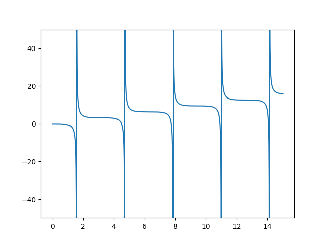

f(x) = x - tan(x)について

# (1) y = f(x) (0 <= x <= 15) のグラフの作成

# (2) 二分法により f(x) = 0の解を求める

> step : 1e-05 
>
> range : -0.01 ~ 15
> 
> |   x                |   error            |
> |--------------------|--------------------|
> |  -0.004995000000000|   0.000000041542206|
> |   4.493409303194534|   0.000003123796801|
> |   7.725251739148588|   0.000005836002828|
> |  10.904121636840848|   0.000002685715685|
> |  14.066193959870581|  -0.000009307061125|
